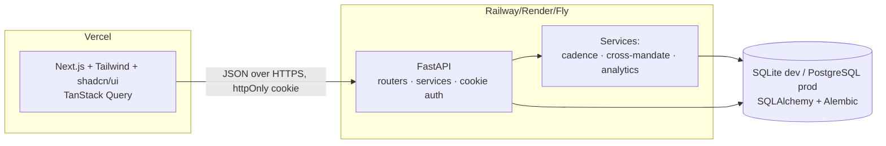
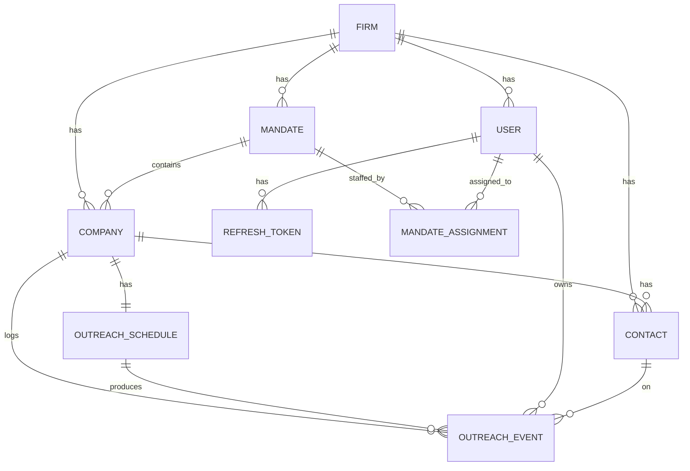
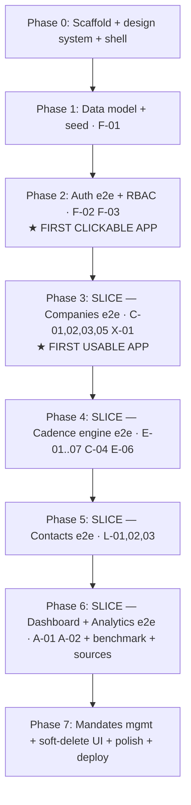

# Project Upstream — Full-Stack CRM Build Plan (v2)

> **A deal-sourcing CRM for M&A / investment-banking workflows.**
> Single source of truth for Claude Code to build the MVP (Foundation + CRM Core).
> **v2** · greenfield build from scratch · vertical-slice delivery · P0/P1 MVP, P2/v1.1 flagged.

---

## Changelog — what changed from v1 (this revision answers a full design review)

| # | Change | Why |
|---|--------|-----|
| 1 | **Confirmed greenfield.** Building from scratch; the PRD's "already on Vercel" note is treated as not-applicable. | Decision made, no longer an unstated assumption. |
| 2 | **Stack kept (FastAPI + Next.js) but as a *deliberate* decision** with trade-off + a real deploy/CORS story (§3). | Honours the "Python/SQL per brief"; the cost (2 deploy targets) is now owned, not hidden. |
| 3 | **Re-cut into vertical slices** (§9): a clickable app after Phase 2, a genuinely usable app after Phase 3. | Get visual feedback and surface integration risk early instead of 6 backend-only phases. |
| 4 | **Cadence semantics nailed down** (§5.2): `initial_date` = *sent* date (nullable; schedule doesn't tick until the initial email is logged), **fixed anchor** to the initial date, and **all date math in IST (Asia/Kolkata)**. | The single highest-value feature was the most ambiguous; now it's deterministic. |
| 5 | **Dropped `primary_contact_id`; primary is derived from `contacts.is_primary`.** | Removes a circular FK and a second source of truth. |
| 6 | **Soft delete / archive instead of hard `DELETE`** (§5, §6). | The product *is* institutional memory on an append-only log; destroying records contradicts it. |
| 7 | **Defined "vs mandate average" concretely + added `/benchmark`; list responses now carry filter-aware `summary` aggregates** (§6, §7). | Closed two places where the UI promised data the API didn't provide. |
| 8 | **Auth = httpOnly Secure cookies + rotating refresh tokens with server-side revocation** (§3, §5, §6). | Sensitive M&A data shouldn't sit in localStorage. |
| 9 | **Cross-mandate dedup reframed as an advisory warning heuristic** with stated limits (§5.3). | Honest about what exact name/domain matching does and doesn't catch. |
| 10 | **Added a frontend test strategy + effort estimates per phase** (§3, §8, §9). | Backend had tests; frontend had none. Your tracker has an Effort column. |

---

## Table of contents

0. [How to use this document (read first, Claude Code)](#0-how-to-use-this-document)
1. [Product overview & refined understanding](#1-product-overview--refined-understanding)
2. [Scope of this build](#2-scope-of-this-build)
3. [Tech stack & why (incl. the deliberate stack decision)](#3-tech-stack--why)
4. [System architecture & repo layout](#4-system-architecture--repo-layout)
5. [Data model — the moat](#5-data-model--the-moat)
6. [API design](#6-api-design)
7. [Frontend — screens, routes & design system](#7-frontend--screens-routes--design-system)
8. [Feature matrix (mapped to PRD IDs, with effort)](#8-feature-matrix-mapped-to-prd-ids-with-effort)
9. [Build phases — vertical slices (dependency-ordered)](#9-build-phases--vertical-slices)
10. [The prompts — one per phase (paste into Claude Code)](#10-the-prompts)
11. [CLAUDE.md — drop this in the repo root](#11-claudemd--drop-this-in-the-repo-root)
12. [Definition of Done — acceptance checklist](#12-definition-of-done)
13. [Appendix](#13-appendix)

---

## 0. How to use this document

**This file is the contract.** It is written to be handed to Claude Code one phase at a time. Do not ask it to "build the whole app" in one prompt — that is the #1 cause of context degradation and specification drift. Instead:

1. Create the repo, drop in `CLAUDE.md` (§11) and this `plan.md`.
2. Work **one phase at a time** (§9). For each phase, paste the matching prompt from §10.
3. After each phase, verify against its acceptance checklist before moving on.
4. Keep a `PROGRESS.md` that Claude Code updates at the end of every phase.

### Prompting principles baked into §10 (so you know *why* the prompts look like this)

Each prompt follows the same proven structure, because clear, structured, example-rich instructions with an explicit "definition of done" produce far better agent output than vague asks:

- **Role + context first** — what we're building and what already exists.
- **Point to the source of truth** — reference the relevant §-sections instead of restating (less drift, less token bloat).
- **One bounded goal per prompt** — scoped to specific PRD IDs.
- **Explicit constraints** — stack, file locations, naming, "do this / never do that."
- **Acceptance criteria = definition of done** — a checklist the agent must self-verify.
- **Plan → build → verify** — outline approach, implement, then run tests/typecheck and report.
- **Positive examples over prose** — field lists, enum values, request/response shapes given concretely.

> Canonical reference for prompt craft: https://docs.claude.com/en/docs/build-with-claude/prompt-engineering/overview

---

## 1. Product overview & refined understanding

### What you described 

> An analyst logs in → sees **all the companies** in their book → sees **company statistics** and **source quality** → can **search / filter** companies → has **lists & categories** ("all companies" view, plus a view that shows the **email schedule** and **email statistics**) → clicks a company → lands on a **company detail page** with **all fields, the full email/outreach history, and stats** → and we **seed the DB with fake data now**, swapping in real data later.

That is a correct, well-scoped MVP. It maps almost 1:1 onto your three live spreadsheets (Master sheet, Contact list, Email Schedule) plus the Foundation + CRM Core rows in your tracker.

### Decisions locked (refinements over the raw idea)

| # | Your instinct | Decision | Why |
|---|---------------|----------|-----|
| 1 | "Python/SQL"; build from scratch | **Greenfield. FastAPI (Python) backend + Next.js frontend** (see §3 for the trade-off). | Honours the brief and your fluency. |
| 2 | "local db now, Postgres later" | **SQLite (dev) → PostgreSQL (prod) behind one `DATABASE_URL`** via SQLAlchemy + Alembic. | Zero-setup dev, painless prod swap, no code change. |
| 3 | Email Schedule = 4 bi-weekly columns | **Outreach is an append-only, time-stamped event log; cadence is computed.** | The F-01 "moat" instruction in your own tracker. |
| 4 | "specific logins for analyst + other views" | **RBAC: Analyst/Associate (assigned mandates) vs Partner (all + escalation + analyst performance).** | Matches F-03; gives the "other views" without separate apps. |
| 5 | "see the quality of the sources" | **`source` + `source_quality` fields + a Sources analytics panel.** | Lightweight now; the hook for the future Sourcing Layer. |
| 6 | "check to previous sheets" (in your Excel) | **Cross-mandate duplicate detection** (advisory warning, §5.3). | X-01, flagged in your tracker as key defensibility. |
| 7 | "click company → details + stats vs previous" | **Company detail = profile + contacts + full outreach timeline + a defined mandate benchmark** (§6.3, §7.2). | Turns "stats" into something concrete and computable. |
| 8 | (implicit) sensitive deal data | **httpOnly-cookie auth, rotating refresh tokens, soft-delete everywhere.** | Security + the institutional-memory premise. |

---

## 2. Scope of this build

**Greenfield, from scratch.** No existing app is extended.

**In scope:** Foundation + CRM Core — every P0 and P1 row in your tracker.

- **Foundation:** data model, cookie-based auth, firm-scoped accounts, roles, deploy basics.
- **CRM Core:** Master List, Email Schedule (cadence engine), Contact List, Cross-Mandate duplicate detection (X-01), Dashboard.

**Built but minimal (P2 / v1.1 — basic now, enrich later):** response-rate-by-bucket (A-01) and analyst-performance (A-02), since you explicitly want statistics.

**Explicitly OUT of scope (do not build now):**

- Feature 2 — **Sourcing Layer** (external feeds, AI ranking). Only the `source` field is added.
- Feature 3 — **Suggested additions** (import wizard, Outlook/Gmail sync, digests, export, templates, per-mandate timeline). Designed-for, deferred.
- X-02 shared contact memory across mandates (contacts are firm-scoped so it slots in later).

---

## 3. Tech stack & why

### The deliberate stack decision (read this)

We use a **two-service architecture: a FastAPI backend + a Next.js frontend.**

- **Why this:** your tracker says "Python/SQL per brief," and your strength is Python — the backend logic (cadence engine, cross-mandate, analytics) lives where you can own it.
- **The cost (owned, not hidden):** two deploy targets and CORS. Python doesn't deploy cleanly to Vercel serverless (cold starts, no persistent pool), so the **backend deploys to Railway/Render/Fly** and the **frontend to Vercel**. We configure CORS + cookie auth for this split from day one (§6).
- **The alternative we did NOT take:** a single Next.js full-stack app (API routes + Prisma) deploys to one Vercel project with no second service — simpler ops, but it drops Python. If ops simplicity ever outweighs the Python brief, this is the swap to make. *Not chosen for v2.*

### Backend
| Choice | Purpose |
|--------|---------|
| Python 3.11+ | Matches the brief; your fluency. |
| FastAPI | Async, typed, free OpenAPI docs at `/docs`. |
| SQLAlchemy 2.0 (async) | ORM; SQLite↔Postgres is a config swap. |
| Pydantic v2 / pydantic-settings | Validation, serialization, config. |
| Alembic | Versioned migrations. |
| python-jose + passlib[bcrypt] | JWT signing + password hashing. |
| Faker | Seed realistic India-market data. |
| pytest + httpx | API tests. |
| uvicorn | ASGI server. |

### Frontend
| Choice | Purpose |
|--------|---------|
| Next.js 14 (App Router) + TypeScript | Production React; deploys to Vercel. |
| Tailwind + shadcn/ui | Clean, professional, "humanised" financial-SaaS look. |
| TanStack Query | Server-state caching; loading/error states. |
| React Hook Form + Zod | Forms + validation mirroring backend schemas. |
| recharts | Dashboard / analytics charts. |
| lucide-react | Icons. |
| **Vitest + React Testing Library** | Component/unit tests. |
| **Playwright** | A few critical-path E2E tests (login, create company, log outreach). |

### Database
- **Dev:** SQLite (`upstream.db`), zero setup.
- **Prod:** PostgreSQL via `DATABASE_URL`. SQLAlchemy + Alembic handle both identically.

### Tooling
`ruff` + `black` (Py), `eslint` + `prettier` (TS), `.env.example` in both apps, optional `docker-compose.yml` for local Postgres, `Makefile`/npm scripts.

---

## 4. System architecture & repo layout



### Monorepo structure

```
upstream-crm/
├── CLAUDE.md                  # persistent context for Claude Code (§11)
├── plan.md                    # this file
├── PROGRESS.md                # updated at the end of each phase
├── README.md
├── docker-compose.yml         # optional: local Postgres
│
├── backend/
│   ├── pyproject.toml
│   ├── .env.example           # DATABASE_URL, JWT_SECRET, COOKIE_DOMAIN, ...
│   ├── alembic/
│   ├── app/
│   │   ├── main.py            # FastAPI app, router mounting, CORS(credentials)
│   │   ├── core/
│   │   │   ├── config.py
│   │   │   ├── security.py    # hashing, JWT, cookie helpers, refresh rotation
│   │   │   ├── time.py        # today_ist() — Asia/Kolkata date helpers
│   │   │   └── deps.py        # get_db, get_current_user, require_role, visible_mandate_ids
│   │   ├── db/{base.py,session.py}
│   │   ├── models/            # one SQLAlchemy model per entity
│   │   ├── schemas/           # Pydantic request/response models
│   │   ├── api/               # auth, mandates, companies, schedule, contacts, analytics
│   │   ├── services/{cadence.py,cross_mandate.py,analytics.py,benchmark.py}
│   │   └── seed/seed.py
│   └── tests/
│
└── frontend/
    ├── package.json
    ├── .env.local.example     # NEXT_PUBLIC_API_URL
    ├── app/                   # App Router routes (§7)
    ├── components/{ui,features}/
    ├── lib/{api.ts,utils.ts}
    ├── hooks/
    ├── types/
    └── tests/                 # Vitest + Playwright
```

---

## 5. Data model — the moat

**Hierarchy:** `Firm → Mandate → Company → Contact`, with `Outreach events` as an append-only log off companies. Contacts are firm-scoped (reusable across mandates in v1.1).



### 5.1 Entities & fields

> `*` = required. Every field traces to your Excel/tracker in §13.1. **Soft delete:** `companies`, `contacts`, `mandates` carry `archived_at` (nullable timestamp); default queries exclude archived rows.

**`firms`** — tenant boundary
`id*`, `name*`, `created_at`, `updated_at`

**`users`**
`id*`, `firm_id*` (FK), `email*` (unique), `hashed_password*`, `full_name*`, `role*` (`ANALYST|ASSOCIATE|PARTNER`), `is_active` (default true), `token_version` (int, default 0 — bump to revoke all sessions), `created_at`, `updated_at`

**`refresh_tokens`** — server-side refresh-token store (rotation + revocation)
`id*`, `user_id*` (FK), `hashed_token*`, `expires_at*`, `revoked` (bool, default false), `created_at`

**`mandates`** — a deal/engagement
`id*`, `firm_id*` (FK), `client_name*`, `name*`, `type*` (`SELL_SIDE|BUY_SIDE|CAPITAL_RAISE`), `status*` (`ACTIVE|ON_HOLD|CLOSED|TERMINATED`), `exchange_rate` (numeric), `exchange_rate_date` (date), `lead_owner_id` (FK→users), `archived_at` (nullable), `created_at`, `updated_at`

**`mandate_assignments`** — visibility control
`id*`, `mandate_id*` (FK), `user_id*` (FK), `created_at` · unique(`mandate_id`,`user_id`)

**`companies`** — Master List
`id*`, `firm_id*` (FK), `mandate_id*` (FK), `company_name*`, `hq`, `type*` (`TARGET|BUYER|INVESTOR`), `status*` (`NOT_CONTACTED|CONTACTED|RESPONDED|INTERESTED|DECLINED|BOUNCED`, default `NOT_CONTACTED`), `rationale` (text), `revenue_source` (text), `revenue_inr_cr` (numeric), `headcount` (int), `website`, `linkedin`, `relevant_investments` (text), `bucket` (text), `source` (`PROPRIETARY|PUBLIC|REFERRAL|IMPORTED`, default `PROPRIETARY`), `source_quality` (`HIGH|MEDIUM|LOW`, default `MEDIUM`), `created_by_id` (FK→users), `archived_at` (nullable), `created_at`, `updated_at`
> **No `primary_contact_id`.** The primary contact is derived: `contacts where company_id = X and is_primary = true`.

**`contacts`** — Contact List (firm-scoped, company-linked)
`id*`, `firm_id*` (FK), `company_id*` (FK), `contact_person*`, `designation`, `email`, `phone`, `linkedin`, `reason` (text), `engagement` (`BUY_SIDE|SELL_SIDE|INVESTOR|ADVISOR|OTHER`), `date_connected` (date), `mode` (`EMAIL|CALL|LINKEDIN|MEETING|EVENT`), `poc_owner_id` (FK→users), `remark` (text), `comments` (text), `is_primary` (bool, default false — **at most one true per company**, enforced in service), `last_contact_date` (date, maintained from events), `archived_at` (nullable), `created_at`, `updated_at`

**`outreach_schedules`** — one per company; cadence *config* + lifecycle
`id*`, `firm_id*` (FK), `company_id*` (FK, unique), `status*` (`AWAITING_INITIAL|ACTIVE|STOPPED`, default `AWAITING_INITIAL`), `initial_date` (date, **nullable** — set to the date the initial email is logged), `cadence_interval_days*` (int, default `14`), `regarding` (text), `stopped_reason` (`RESPONDED|BOUNCED|DECLINED|TERMINATED|MANUAL|null`), `stopped_at` (timestamp, nullable), `created_at`, `updated_at`

**`outreach_events`** — **append-only** log; every touch, never updated/deleted
`id*`, `firm_id*` (FK), `company_id*` (FK), `schedule_id` (FK, nullable), `contact_id` (FK, nullable), `event_type*` (`INITIAL_EMAIL|FOLLOW_UP|RESPONSE|BOUNCE|CALL|LINKEDIN|MEETING|NOTE`), `occurred_on*` (date), `regarding` (text), `notes` (text), `owner_id*` (FK→users), `created_at`

### 5.2 Cadence engine — exact semantics (the highest-value feature)

All date math uses **`today_ist()`** (current date in `Asia/Kolkata`). Dates are stored as `DATE` (no time); timestamps as UTC.

**Lifecycle of a schedule:**
1. **`AWAITING_INITIAL`** — created automatically when a company is added (C-04). No `initial_date`, no due dates. The company shows in the **"Needs first outreach"** queue. *The clock does not tick before the first email is sent.*
2. **`ACTIVE`** — when the analyst logs an `INITIAL_EMAIL` event, set `initial_date = event.occurred_on` and `status = ACTIVE`. Follow-ups are now computed.
3. **`STOPPED`** — set automatically when company `status ∈ {RESPONDED, BOUNCED, DECLINED}`, when a `RESPONSE`/`BOUNCE` event is logged, when the mandate is `TERMINATED`, or manually. Record `stopped_reason` + `stopped_at`. No further reminders.

**Computed fields (for `ACTIVE` schedules only):**
```
followups_done       = count(events where event_type == FOLLOW_UP for this schedule)
next_followup_number = followups_done + 1
next_due_date        = initial_date + (next_followup_number × cadence_interval_days) days   # FIXED anchor
days_remaining       = (next_due_date − today_ist()).days
is_overdue           = (status == ACTIVE) and (days_remaining < 0)
```

**Anchor decision (explicit):** the cadence is **fixed-anchored to `initial_date`** — exactly like your Excel (initial, +14, +28, +42, +56). A late follow-up does **not** shift the anchor; `next_due_date` is always `initial_date + n×interval`. *(The alternative — re-anchor to the last actual touch — is a documented v1.1 option, not the MVP behavior.)*

**Queues:**
- **Needs first outreach** = schedules with `status == AWAITING_INITIAL`.
- **Due this week** = `status == ACTIVE` and `days_remaining ≤ window` (default 7; includes overdue/negative).
- **Overdue** = `status == ACTIVE` and `is_overdue`.

### 5.3 Cross-mandate duplicate detection (X-01) — advisory heuristic

In `services/cross_mandate.py`. On company create and via a check endpoint:
```
normalize(name) -> lowercase, strip punctuation + suffixes (ltd, pvt, inc, llp, co)
domain(website) -> registrable domain
match if (normalized_name equal) OR (domain equal), same firm, different mandate
```
Returns a **non-blocking warning** with the other mandate, the company's status there, and last outreach date. The analyst can proceed.

> **Honest limits:** exact normalized-name/domain matching will **miss** subsidiaries, holding-company variants ("Tata" vs "Tata Sons"), and DBAs, and may over-match common words. It's an advisory aid, not entity resolution. Fuzzy matching / proper entity resolution is a v1.1 improvement.

### 5.4 Benchmark service (the "vs mandate average", §7.2) — defined

In `services/benchmark.py`. `GET /companies/{id}/benchmark` returns concrete, computable numbers for the company's mandate (excluding archived):
```
mandate_response_rate          = responded_companies / total_companies in mandate
mandate_avg_touches_to_response= avg(count of outreach events up to first RESPONSE) over responded companies
mandate_avg_days_to_response   = avg(first_response_date − initial_date) over responded companies
this_company_touches           = count of outreach events for this company
this_company_days_to_response  = (first RESPONSE date − initial_date) or null if no response yet
```
The UI renders simple comparisons ("3 touches · mandate avg 4.2", "responded in 9 days · mandate avg 14"). **"Responded"** is defined once: `status == RESPONDED` OR a `RESPONSE` event exists; reuse everywhere.

### 5.5 Seeding (Faker — India-market flavour)

`backend/app/seed/seed.py` makes the UI never-empty and exercises every feature:
- **1 firm** ("Upstream Capital Advisors"), **5 users**: 1 partner + 4 analysts/associates, mandate assignments set.
- **4–6 mandates** (sell-side/buy-side), Indian client names, INR exchange rates.
- **~120 companies** across mandates (Indian + global acquirers), realistic `revenue_inr_cr`, headcount, buckets ("Strategic", "Financial/PE", "Tier-1").
- **1–3 contacts/company**, exactly one `is_primary`.
- **Schedules in a realistic mix:** some `AWAITING_INITIAL` (no initial email yet), most `ACTIVE` with staggered `initial_date`s (mix of due-soon / overdue), some `STOPPED`. Contacted companies have a logged `INITIAL_EMAIL`; responded ones have a `RESPONSE` event + a stopped schedule.
- **~5–10% deliberate cross-mandate duplicates** so X-01 has something to detect.
- Prints demo logins, e.g. `analyst@upstream.test / Passw0rd!` and `partner@upstream.test / Passw0rd!`.
- `python -m app.seed.seed` (idempotent; `--reset` wipes first).

---

## 6. API design

REST, JSON, **httpOnly-cookie auth**, all routes firm-scoped via `get_current_user`. Interactive docs at `/docs`.

### 6.0 Auth & sessions (cookie-based)
- Login sets an **httpOnly, Secure** access-token cookie and a refresh-token cookie. `SameSite=Lax` if frontend/backend share a site; `SameSite=None; Secure` for the split-origin Vercel↔Railway case. CORS uses `allow_credentials=true` with an explicit origin (no `*`).
- **Refresh rotation:** each refresh issues a new refresh token and revokes the old one (server-side `refresh_tokens` row). `token_version` on the user enables "log out everywhere".

| Method | Path | Body | Effect |
|---|---|---|---|
| POST | `/auth/signup` | firm_name, full_name, email, password | creates firm + first user (PARTNER); sets cookies |
| POST | `/auth/login` | email, password | sets access + refresh cookies |
| POST | `/auth/refresh` | — (refresh cookie) | rotates tokens |
| POST | `/auth/logout` | — | clears cookies, revokes refresh token |
| GET | `/auth/me` | — | current user (id, name, role, firm) |

### 6.1 Mandates
| Method | Path | Notes |
|---|---|---|
| GET | `/mandates` | analyst → assigned only; partner → all |
| POST | `/mandates` | create |
| GET | `/mandates/{id}` | detail + summary stats |
| PATCH | `/mandates/{id}` | edit |
| POST | `/mandates/{id}/archive` · `/unarchive` | soft archive (partner) |
| GET | `/mandates/{id}/companies` | companies under this mandate |
| POST | `/mandates/{id}/assignments` | assign user (partner only) |

### 6.2 Companies (Master List)
| Method | Path | Notes |
|---|---|---|
| GET | `/companies` | params: `q`, `status`, `type`, `bucket`, `mandate_id`, `source`, `sort`, `page`, `page_size`, `include_archived`. Returns the **summary envelope** below. Each item includes computed `next_due_date`, `days_remaining`, `is_overdue`, schedule `status`, primary-contact summary. |
| POST | `/companies` | create → **auto-creates an `AWAITING_INITIAL` schedule** (C-04); returns cross-mandate warnings (X-01) |
| GET | `/companies/{id}` | full detail: all fields + contacts + outreach timeline + schedule |
| GET | `/companies/{id}/benchmark` | the §5.4 mandate comparison |
| PATCH | `/companies/{id}` | edit; status → RESPONDED/BOUNCED/DECLINED stops the schedule (E-04) |
| DELETE | `/companies/{id}` | **soft delete** (sets `archived_at`); history preserved |
| GET | `/companies/check-duplicate` | `?name=&website=&mandate_id=` → warnings without creating |

**List summary envelope (fixes the filter-aware stat strip):**
```json
{
  "items": [ ... ],
  "total": 137,
  "page": 1,
  "page_size": 25,
  "summary": {
    "responded_pct": 0.31,
    "overdue_count": 12,
    "needs_initial_count": 8,
    "by_status": { "NOT_CONTACTED": 40, "CONTACTED": 55, "RESPONDED": 30, ... }
  }
}
```
`summary` is computed over the **whole filtered set**, not just the current page.

### 6.3 Outreach / Schedule (cadence engine)
| Method | Path | Notes |
|---|---|---|
| GET | `/schedule/needs-initial` | companies whose schedule is `AWAITING_INITIAL` (scoped) |
| GET | `/schedule/due` | work queue; `?window=7`; overdue first; scoped |
| GET | `/schedule/overdue` | partner escalation view (E-05) |
| GET | `/companies/{id}/schedule` | config + computed next-due |
| PATCH | `/companies/{id}/schedule` | edit interval/regarding, pause/resume (NOT `initial_date`) |
| GET | `/companies/{id}/events` | full history (the log) |
| POST | `/companies/{id}/events` | log a touch. `INITIAL_EMAIL` activates the schedule + sets `initial_date`; `FOLLOW_UP` advances cadence; `RESPONSE`/`BOUNCE` stops it + sets status |

### 6.4 Contacts
| Method | Path | Notes |
|---|---|---|
| GET | `/contacts` | `?q=&company_id=&engagement=&include_archived=` |
| POST | `/contacts` | create (linked to company) |
| GET | `/contacts/{id}` | profile + chronological touch history (L-03) |
| PATCH | `/contacts/{id}` | edit; setting `is_primary` unsets any other primary on the company |
| DELETE | `/contacts/{id}` | **soft delete** |

### 6.5 Analytics & stats
| Method | Path | Returns |
|---|---|---|
| GET | `/analytics/overview` | counts by status/type, total, % responded, due-this-week, overdue, needs-initial |
| GET | `/analytics/response-by-bucket` | response rate by bucket/sector (A-01) |
| GET | `/analytics/by-analyst` | volume / responses / conversion per analyst (A-02; **partner only**) |
| GET | `/analytics/sources` | counts + response rate by `source` / `source_quality` |

**Conventions:** snake_case JSON; ISO-8601 dates; list envelope as above; error shape `{ detail }`; computed cadence fields always present on company reads (frontend never recomputes); all reads exclude archived unless `include_archived=true`.

---

## 7. Frontend — screens, routes & design system

### 7.1 Route map (Next.js App Router)
| Route | Screen | Who |
|---|---|---|
| `/login` | Login | public |
| `/` → `/dashboard` | **Dashboard** — KPI cards, due-this-week, needs-initial, overdue, status mix | all |
| `/companies` | **All Companies** — searchable/filterable/sortable table + filter-aware stat strip | all (scoped) |
| `/companies/[id]` | **Company detail** — profile, contacts, outreach timeline, cadence, mandate benchmark | all (scoped) |
| `/mandates` · `/mandates/[id]` | Mandates list / detail (+ assignment, archive) | all (scoped) |
| `/schedule` | **Email Schedule / Work Queue** — needs-initial + due-this-week + overdue + email stats | all (scoped) |
| `/contacts` · `/contacts/[id]` | Contact List / profile + touch history | all (scoped) |
| `/analytics` | **Analytics** — response-by-bucket, by-analyst (partner), source quality | analyst (own) / partner (all) |
| `/settings` | Firm/cadence settings | partner |

### 7.2 Screen specs (the ones you called out)

**Login** — email/password card; role inferred from account; error states; redirect to `/dashboard`.

**Dashboard** — KPI stat-cards (Total companies, % responded, **Needs first outreach**, Due this week, Overdue, Active mandates) from `/analytics/overview`; a Due-this-week mini-list; a status-mix donut + response-by-bucket bar (recharts). Partner = firm-wide; analyst = own book.

**All Companies view** — the workhorse table. Columns: Company, Type, Mandate/Bucket, Status (coloured badge), schedule state (Needs-initial / Next-due + days-remaining pill, red if overdue), Primary contact, Source (quality dot). Sticky header with free-text search + filters (Status / Type / Bucket / Mandate / Source) and an **Archived** toggle. Sortable columns; row click → detail. A **filter-aware stat strip** above the table fed by the response `summary` (count, responded %, overdue, needs-initial) — reflects active filters, not just the page.

**Email Schedule / Work Queue** (`/schedule`) — the analyst's daily driver, grouped **Needs first outreach → Overdue → Due today → Due this week → Upcoming**. Each row: company, mandate, last touch, next due, days-remaining, **"Log outreach"** (appends an event; first one is the initial email that activates the schedule). An email-stats panel: sent this week, responses this week, response rate, overdue count.

**Company detail (click-through)** — header (name, type, status badge, source/quality, mandate link) with a **benchmark strip** from `/companies/{id}/benchmark` ("3 touches · mandate avg 4.2"; "responded in 9d · avg 14d"). Sections: **Overview** (all Master-sheet fields), **Contacts** (people here; primary flagged), **Outreach timeline** (full event log, newest first, type icons + dates + owner + notes), **Cadence** (schedule state, initial date, interval, next due, pause/resume — initial date read-only). A **"Log outreach"** dialog. A **cross-mandate-duplicate banner** when applicable. An **Archive** action (soft delete).

**Analytics** — response-rate-by-bucket bar; by-analyst table (partner only); a **Source-quality** panel (counts + response rate by source/quality) — directly answering "see the quality of the sources".

### 7.3 Design system direction

Tell Claude Code to **use its `frontend-design` skill if available; otherwise these tokens are authoritative:**

- **Aesthetic:** restrained, data-dense financial SaaS (Linear/Stripe-dashboard calm). Generous whitespace, one accent colour, neutral greys, crisp 1px borders.
- **Status colours (consistent everywhere):** Responded = green, Interested = blue, Declined = amber, Bounced = red, Contacted = slate, Not contacted = grey. Overdue pill = red; due-soon = amber; needs-initial = violet.
- **Components:** shadcn/ui (`Table`, `Badge`, `Card`, `Dialog`, `Tabs`, `Select`, `Input`, `DropdownMenu`, `Toast`). Forms via React Hook Form + Zod.
- **States:** every list has a loading skeleton, an empty state with a CTA, and an error state.
- **Layout:** persistent left sidebar (Dashboard, Companies, Schedule, Contacts, Mandates, Analytics, Settings) with role-gated items; top bar with firm name + user menu + role badge.
- **Responsive:** desktop-first (analyst tool); tables degrade to cards on narrow screens.

### 7.4 Frontend testing
- **Vitest + React Testing Library:** the status-badge mapping, the cadence/days-remaining pill rendering, the company table filtering, and form validation.
- **Playwright (critical paths):** log in → land on dashboard; create a company → it appears in "Needs first outreach"; log an initial outreach → it moves to "Due this week"; log a RESPONSE → status flips and cadence stops.

---

## 8. Feature matrix (mapped to PRD IDs, with effort)

> `[ ]` until its acceptance criteria pass. Effort = rough developer-days *with* Claude Code doing the heavy lifting (estimates, not promises).

### Foundation
- `[ ]` **F-01** Data model — ER approved; tables created; contact reusable across mandates; outreach = event log. *(P0 · ~3d)*
- `[ ]` **F-02** Auth — cookie signup/login/logout; firm-scoped data. *(P0 · dep F-01 · ~2d)*
- `[ ]` **F-03** Roles — partner sees all; analyst sees assigned. *(P1 · dep F-02 · ~0.5d)*
- `[ ]` **F-04** Infra — deploy from main; daily backup; `DATABASE_URL` engine swap. *(P1 · dep F-01 · folded into phases)*

### CRM Core — Master List
- `[ ]` **C-01** CRUD companies, all fields. *(P0 · dep F-01 · ~2d)*
- `[ ]` **C-02** Link company ↔ mandate; filter by mandate. *(P0 · dep C-01 · ~0.5d)*
- `[ ]` **C-03** Status field driving cadence stop. *(P0 · dep C-01 · ~0.5d)*
- `[ ]` **C-04** Auto-create (AWAITING_INITIAL) schedule on add. *(P0 · dep C-01,E-01 · ~0.5d)*
- `[ ]` **C-05** Filter / search / sort + summary aggregates. *(P1 · dep C-01 · ~1.5d)*

### CRM Core — Email Schedule
- `[ ]` **E-01** Initial-date anchor (set on first outreach; immutable after). *(P0 · dep C-01 · ~0.5d)*
- `[ ]` **E-02** Auto follow-ups, configurable interval (default bi-weekly). *(P0 · dep E-01 · ~1d)*
- `[ ]` **E-03** Compute next-due + days-remaining (IST). *(P0 · dep E-02 · ~1d)*
- `[ ]` **E-04** Stop on response/bounce/terminated. *(P0 · dep C-03,E-02 · ~0.5d)*
- `[ ]` **E-05** Overdue flags + partner escalation. *(P1 · dep E-03 · ~0.5d)*
- `[ ]` **E-06** Preserve full outreach history (append-only). *(P1 · dep F-01,E-01 · ~0.5d)*
- `[ ]` **E-07** Needs-initial + due-this-week queues. *(P1 · dep E-03 · ~1d)*

### CRM Core — Contact List
- `[ ]` **L-01** Person-level contacts, all fields, company-linked. *(P0 · dep C-01 · ~2d)*
- `[ ]` **L-02** Engagement + response type + POC owner. *(P1 · dep L-01 · ~0.5d)*
- `[ ]` **L-03** Last-contact date + history on a contact. *(P1 · dep L-01,E-06 · ~0.5d)*

### Cross-Mandate & Analytics
- `[ ]` **X-01** Duplicate-target detection (advisory). *(P1 · dep F-01,C-01 · ~1.5d)*
- `[ ]` **X-02** Shared contact memory across mandates. *(P2/v1.1 — deferred)*
- `[ ]` **A-01** Response rate by sector/bucket. *(basic now · dep E-06,L-02 · ~1d)*
- `[ ]` **A-02** Analyst outreach performance (partner). *(basic now · dep E-06 · ~1d)*

**Rough total (Foundation + CRM Core MVP): ~22–25 developer-days.**

---

## 9. Build phases — vertical slices

Each phase is one Claude Code session. Don't start a phase until the previous one's acceptance checklist passes (this enforces the `Depends On` graph). **Phases 0–2 are foundation; Phases 3–6 are vertical full-stack slices that are each independently demoable.**



- **★ End of Phase 2** — you can log in (analyst + partner) and see the gated shell. First clickable app.
- **★ End of Phase 3** — log in → browse/search/filter companies → open a company detail. First genuinely usable, demoable app. Every later phase adds a working feature on top.

---

## 10. The prompts

> Paste one block per session. Each assumes the repo, `plan.md`, and `CLAUDE.md` exist. Verify the acceptance checklist before continuing.

### Prompt — Phase 0: Scaffold + design system + shell

```
You are setting up a new GREENFIELD monorepo for a production-grade M&A deal-sourcing CRM
("Project Upstream"). Read plan.md §3, §4, §7.3, and §11 fully before doing anything.

Goal: create the monorepo skeleton, tooling, the frontend design system + app shell, and
"hello world" health checks. No business logic yet.

Tasks:
1. Create the folder structure in plan.md §4 (backend/ + frontend/).
2. Backend: FastAPI app with GET /health, pyproject.toml with the §3 deps, .env.example
   (DATABASE_URL default sqlite, JWT_SECRET, COOKIE_DOMAIN, ACCESS/REFRESH lifetimes),
   ruff+black, an async SQLAlchemy engine reading DATABASE_URL, Alembic initialized, and
   app/core/time.py with today_ist() (Asia/Kolkata). Configure CORS with allow_credentials.
3. Frontend: scaffold Next.js 14 (App Router, TS), Tailwind, shadcn/ui, a TanStack Query
   provider, .env.local.example (NEXT_PUBLIC_API_URL), and a typed fetch client in
   lib/api.ts that sends credentials: 'include' (cookie auth) and redirects to /login on 401.
4. Frontend design system + shell per §7.3: StatusBadge (exact §7.3 colour map), StatCard,
   DataTable wrapper, EmptyState, loading skeleton, the left sidebar + top bar layout
   (role-gated items wired but static for now), and a placeholder /dashboard.
5. Create CLAUDE.md from §11 verbatim, README (run + deploy: frontend→Vercel,
   backend→Railway/Render with Postgres DATABASE_URL), and PROGRESS.md.
6. Add docker-compose.yml for local Postgres (optional path) and a Playwright config.

Constraints: GREENFIELD — assume nothing pre-exists. No models/auth/business logic yet.
Use the exact §3 stack. Secrets only in .env.example. Cookie-based auth (no localStorage).

Acceptance criteria:
- `uvicorn app.main:app --reload` → GET /health 200.
- `npm run dev` renders the shell + placeholder dashboard, no console errors.
- StatusBadge/StatCard/EmptyState/skeleton exist and match §7.3.
- CLAUDE.md, README.md, PROGRESS.md exist.

When done: update PROGRESS.md (Phase 0 done + how to run both apps) and summarize.
```

### Prompt — Phase 1: Data model + seed (F-01)

```
Read plan.md §5 in full (entities, soft-delete, cadence semantics §5.2, cross-mandate §5.3,
benchmark §5.4, seeding §5.5) and CLAUDE.md. Implement the complete data model — the moat.

Goal: F-01 — all SQLAlchemy models, enums, an Alembic migration, Pydantic schemas, and a
Faker seed producing a realistic India-market demo.

Tasks:
1. Implement every entity/field in §5.1 as SQLAlchemy 2.0 models (one file per entity),
   with §5.1/§13.2 enums, all FKs, uniqueness, timestamps, firm_id on every table,
   archived_at on companies/contacts/mandates, refresh_tokens, users.token_version, and
   outreach_schedules.status (AWAITING_INITIAL/ACTIVE/STOPPED) with NULLABLE initial_date.
   DO NOT add primary_contact_id — primary is derived from contacts.is_primary.
2. Generate + apply the initial Alembic migration.
3. Pydantic v2 read/create/update schemas in app/schemas/ for every entity.
4. Write app/seed/seed.py per §5.5: 1 firm, 5 users (1 partner) + assignments, 4–6 mandates
   with INR rates, ~120 companies, 1–3 contacts each (exactly one is_primary), schedules in
   a realistic mix of AWAITING_INITIAL / ACTIVE (staggered initial_date, some overdue) /
   STOPPED, INITIAL_EMAIL events for contacted companies, RESPONSE events + stopped schedules
   for responded ones, and ~5–10% deliberate cross-mandate duplicates. Support --reset.
   Print demo logins.

Constraints: outreach is APPEND-ONLY — no follow-up date columns anywhere. Contacts are
firm-scoped. No API/auth this phase. Hash seed passwords with the real hasher. No row is
ever hard-deleted by the app — model archived_at accordingly.

Acceptance criteria:
- `alembic upgrade head` builds all tables on a fresh SQLite DB.
- `python -m app.seed.seed --reset` populates; re-running is clean.
- Inspection shows: a contact reachable from >1 mandate; RESPONDED companies have a stopped
  schedule + RESPONSE event; some AWAITING_INITIAL schedules (no initial_date); some
  cross-mandate duplicates; exactly one primary contact per company.
- Pydantic schemas import cleanly.

When done: update PROGRESS.md (final schema + seed counts + demo logins) and summarize.
```

### Prompt — Phase 2: Auth e2e + RBAC (F-02, F-03) — ★ first clickable app

```
Read plan.md §6.0, §5.1 (users/roles/refresh_tokens), §3 (cookie auth), and CLAUDE.md.
Build cookie-based auth end to end (backend + frontend login) with role-based, firm-scoped
access. This is the first clickable milestone.

Tasks (backend):
1. core/security.py: bcrypt hashing; JWT encode/decode; httpOnly+Secure cookie helpers
   (SameSite per §6.0); refresh-token rotation backed by the refresh_tokens table; honor
   users.token_version.
2. core/deps.py: get_db, get_current_user (reads access cookie), require_role(...),
   get_current_firm_id, and visible_mandate_ids(user) (partner→all, analyst→assigned).
3. api/auth.py: /auth/signup (creates firm + first user as PARTNER), /auth/login,
   /auth/refresh, /auth/logout, GET /auth/me — all per §6.0, setting/clearing cookies.
4. Document the firm-scoping + visibility pattern in CLAUDE.md; provide a reusable scoped
   query helper for later phases.

Tasks (frontend):
5. /login page (React Hook Form + Zod) hitting /auth/login with credentials:'include'.
6. A useAuth hook (current user + role via /auth/me), a protected layout that redirects
   unauthenticated users to /login, and role-gating of sidebar items (analysts: no Settings,
   no by-analyst analytics).

Constraints: cookie auth only (no tokens in JS/localStorage). Never return password hashes.
CORS allow_credentials with explicit origin. Write pytest for signup/login/wrong-password/
/auth/me/refresh-rotation and that an analyst can't see another firm's or unassigned
mandate's data. Add a Playwright test: login → dashboard.

Acceptance criteria:
- Seeded analyst + partner can log in; wrong creds error; logout clears the session.
- No/invalid cookie → 401 → frontend redirects to /login.
- Refresh rotates the token; revoked/old refresh fails; token_version bump logs out.
- Analyst cannot read outside their firm/unassigned mandates (test proves it).
- pytest + the Playwright login test pass.

When done: update PROGRESS.md and summarize the auth + scoping pattern.
```

### Prompt — Phase 3: SLICE — Companies end-to-end (C-01,02,03,05 + X-01) — ★ first usable app

```
Read plan.md §6.2 (incl. summary envelope), §5.1 (companies), §5.3 (cross-mandate), §7.2
(All Companies + Company detail Overview), §7.4, and CLAUDE.md. Build the Companies feature
end to end (backend + frontend). USE the frontend-design skill if available; else §7.3.

Tasks (backend):
1. api/companies.py — every route in §6.2, firm-scoped AND visibility-scoped (reuse Phase 2
   helper). GET /companies supports q/status/type/bucket/mandate_id/source/sort/page/
   page_size/include_archived and returns the §6.2 summary envelope (aggregates over the
   whole filtered set). Each item includes computed cadence fields + schedule status +
   primary-contact summary.
2. POST /companies: validate, create, AUTO-CREATE an AWAITING_INITIAL schedule (C-04, no
   initial_date yet), return cross-mandate warnings (§5.3, non-blocking).
3. PATCH /companies/{id}: editable incl. status (C-03); RESPONDED/BOUNCED/DECLINED stops the
   schedule (the E-04 hook). DELETE = soft delete (archived_at). check-duplicate endpoint +
   the §5.3 service (with its stated limits).

Tasks (frontend):
4. /companies (§7.2): the table (Company, Type, Mandate/Bucket, Status badge, schedule
   state/days-remaining pill, Primary contact, Source dot), search + filters + Archived
   toggle + sort + pagination, and the filter-aware stat strip fed by `summary`. Row → detail.
5. /companies/[id] Overview (§7.2): header + all Master-sheet fields, edit + archive actions,
   create-company dialog, and the cross-mandate-duplicate banner. (Contacts/timeline/benchmark
   tabs are stubbed here; filled in later phases.)

Constraints: never recompute cadence on the client — use API computed fields. Loading/empty/
error states. Zod schemas mirror the backend. Write pytest (CRUD, the filter/search matrix,
summary aggregates, soft delete, auto-schedule creation, duplicate detection) + a Vitest test
for table filtering + a Playwright test (create company → appears in list/needs-initial).

Acceptance criteria:
- Log in → browse/search/filter/sort/paginate companies → open a detail. (Usable app.)
- Creating a company returns 201, creates an AWAITING_INITIAL schedule, warns on a dup.
- The stat strip reflects active filters (whole set, not page).
- status=RESPONDED stops that schedule; DELETE archives (still visible with include_archived).
- pytest + Vitest + Playwright pass; /docs shows the routes.

When done: update PROGRESS.md and summarize.
```

### Prompt — Phase 4: SLICE — Cadence engine end-to-end (E-01…E-07, C-04 finalize, E-06)

```
Read plan.md §5.2 (exact cadence semantics), §6.3, §7.2 (Email Schedule), §7.4, CLAUDE.md.
Build the cadence engine end to end — the highest-value automation. USE frontend-design skill
if available; else §7.3.

Tasks (backend):
1. services/cadence.py implementing §5.2 EXACTLY: schedule lifecycle (AWAITING_INITIAL→ACTIVE
   on first INITIAL_EMAIL, setting initial_date; →STOPPED on response/bounce/terminated/manual),
   and the fixed-anchor computed fields (followups_done → next_due_date = initial_date +
   n×interval → days_remaining via today_ist() → is_overdue). initial_date immutable once set.
2. Outreach routes (§6.3): GET/PATCH /companies/{id}/schedule (interval/regarding/pause-resume,
   never initial_date); GET/POST /companies/{id}/events (INITIAL_EMAIL activates; FOLLOW_UP
   advances; RESPONSE/BOUNCE stops + sets status); GET /schedule/needs-initial, /schedule/due
   ?window=7 (overdue first), /schedule/overdue (partner). Maintain contacts.last_contact_date.
3. Events are append-only — no update/delete to "edit history".

Tasks (frontend):
4. /schedule (§7.2): grouped Needs first outreach → Overdue → Due today → Due this week →
   Upcoming, each row with a "Log outreach" action; the email-stats panel (sent this week,
   responses this week, response rate, overdue count).
5. Company detail: fill the Outreach timeline tab (full event log, newest first, type icons)
   and the Cadence tab (state, initial date [read-only], interval, next due, pause/resume) +
   the "Log outreach" dialog.

Constraints: due-this-week = ACTIVE & days_remaining ≤ window. Match §5.2 by hand. pytest for
the cadence math (incl. overdue, activation, stop-on-response), the queues, and append-only
behaviour; Playwright: log initial outreach → moves to Due this week; log RESPONSE → status
flips + cadence stops.

Acceptance criteria:
- For a known initial_date+interval, next_due_date/days_remaining match §5.2 exactly.
- A new company sits in Needs-first-outreach until an INITIAL_EMAIL is logged, then ticks.
- RESPONSE stops the cadence + updates status; no further reminders.
- /schedule/due correct + overdue-first; partner firm-wide, analyst own book.
- pytest + Playwright pass.

When done: update PROGRESS.md and summarize the cadence rules.
```

### Prompt — Phase 5: SLICE — Contacts end-to-end (L-01, L-02, L-03)

```
Read plan.md §6.4, §5.1 (contacts), §7.2 (Contacts; company-detail Contacts tab), §7.4,
CLAUDE.md. Build Contacts end to end. USE frontend-design skill if available; else §7.3.

Tasks (backend):
1. api/contacts.py per §6.4, firm-scoped, all §5.1 fields (engagement/mode/poc_owner/reason/
   remark/comments/is_primary). Setting is_primary unsets any other primary on that company.
   DELETE = soft delete.
2. GET /contacts/{id}: include chronological touch history from outreach_events where
   contact_id matches (L-03), plus last_contact_date + notes.

Tasks (frontend):
3. /contacts + /contacts/[id]: list with search + engagement filter + Archived toggle;
   profile with chronological touch history and notes; create/edit dialogs.
4. Company detail: fill the Contacts tab (people at this company, primary flagged, add/edit).

Constraints: a contact belongs to a company but is firm-scoped (don't hard-couple to one
mandate — X-02 later). pytest for CRUD, primary toggling, touch-history assembly, soft delete;
Vitest for the contact form.

Acceptance criteria:
- Contact CRUD respects firm scope + soft delete.
- GET /contacts/{id} returns correct chronological history from the event log.
- Marking a contact primary unsets the previous primary and reflects on the company.
- pytest + Vitest pass.

When done: update PROGRESS.md and summarize.
```

### Prompt — Phase 6: SLICE — Dashboard + Analytics end-to-end (A-01, A-02 basic + benchmark + sources)

```
Read plan.md §6.5, §5.4 (benchmark), §7.2 (Dashboard, Analytics, company benchmark strip),
§7.4, CLAUDE.md. Build the stats end to end. USE frontend-design skill if available; else §7.3.

Tasks (backend):
1. services/analytics.py + api/analytics.py per §6.5: /analytics/overview (totals, by-status/
   type, % responded, due-this-week, overdue, needs-initial), /response-by-bucket (A-01),
   /by-analyst (A-02, partner only via require_role), /sources (counts + response rate by
   source/source_quality). "Responded" defined once per §5.4 and reused. Group-by in SQL.
2. services/benchmark.py + GET /companies/{id}/benchmark per §5.4 (mandate response rate, avg
   touches-to-response, avg days-to-response, this company's touches + days-to-response).

Tasks (frontend):
3. /dashboard: wire the KPI cards + due-this-week mini-list + status-mix donut +
   response-by-bucket bar to the analytics endpoints (partner firm-wide, analyst own book).
4. /analytics: response-by-bucket chart, by-analyst table (partner only), Source-quality panel.
5. Company detail: fill the benchmark strip from /companies/{id}/benchmark.

Constraints: analytics respect firm + visibility scoping. pytest asserting numbers against the
seed; by-analyst 403 for analyst, 200 for partner.

Acceptance criteria:
- /analytics/overview coherent vs seed; response-by-bucket + sources non-empty + correct.
- by-analyst gated to partners.
- Company benchmark strip shows correct mandate comparisons.
- Dashboard + analytics render scoped data, no console errors.
- pytest passes.

When done: update PROGRESS.md and summarize.
```

### Prompt — Phase 7: Mandates management + soft-delete UI + polish + deploy

```
Read plan.md §6.1 (mandates), §7.1/§7.2, §12 (Definition of Done), CLAUDE.md. Finish mandates,
soft-delete UX, polish to production/startup quality, and document deploy. USE frontend-design
skill if available; else §7.3.

Tasks:
1. /mandates + /mandates/[id]: list (role-scoped), detail (its companies + a mini
   email-schedule + mandate-level stats), partner assignment of analysts, and archive/unarchive.
2. Soft-delete UX everywhere: Archived toggles on companies/contacts/mandates lists, archive +
   unarchive actions, confirmation dialogs (make clear data is archived, not destroyed).
3. Polish pass: consistent spacing/typography, real empty states with CTAs, toasts on
   create/edit/log/archive, focus states, mobile table→card degradation, 404/error pages.
4. README "Deploy" section: frontend→Vercel; backend→Railway/Render with DATABASE_URL=Postgres
   and SameSite=None;Secure cookies for the split origin; note the daily DB backup (F-04).
5. Final QA against §12 and fix gaps. Add the remaining Playwright critical-path tests.

Constraints: respect role gating (by-analyst analytics, Settings, assignment = partner). Keep
the calm financial-SaaS look.

Acceptance criteria:
- Mandate list role-scoped; partner can assign an analyst → changes that analyst's visible book.
- Archive/unarchive works across companies/contacts/mandates; archived rows hidden by default.
- §12 checklist passes end to end on the seeded data.
- Polished + consistent; no console errors; both apps documented to deploy.
- pytest + Vitest + Playwright pass.

When done: mark the build complete in PROGRESS.md and write a short "how to demo" guide.
```

---

## 11. CLAUDE.md — drop this in the repo root

> Claude Code auto-reads `CLAUDE.md`. Keep it short and stable.

```markdown
# Project Upstream — CLAUDE.md

## What this is
A multi-tenant CRM for M&A / investment-banking deal sourcing. It productises three
spreadsheets (Master List, Email Schedule, Contact List) into one connected system.
Greenfield build. Full spec in plan.md — read the relevant section before each task.

## Domain glossary
- Firm: the IB firm using the CRM (tenant boundary — everything is firm-scoped).
- Mandate: a deal/engagement (sell-side / buy-side / capital-raise).
- Company (Target/Buyer/Investor): a Master List row, linked to a mandate.
- Contact: a person at a company (firm-scoped, reusable across mandates later).
- Outreach: emails/touches stored as an APPEND-ONLY event log (never columns).
- Cadence: the follow-up schedule, computed from a FIXED anchor = the initial-email date.

## Stack (do not substitute)
- Backend: FastAPI, SQLAlchemy 2.0 (async), Pydantic v2, Alembic, JWT in httpOnly cookies
  (python-jose + passlib[bcrypt]), pytest. DB = SQLite (dev) / PostgreSQL (prod) via DATABASE_URL.
- Frontend: Next.js 14 (App Router) + TS, Tailwind, shadcn/ui, TanStack Query, React Hook
  Form + Zod, recharts, lucide-react. Vitest + RTL + Playwright for tests. Use the
  frontend-design skill if available; else plan.md §7.3 tokens are authoritative.

## Non-negotiable rules
1. Outreach is an append-only event log — never store follow-up dates as columns, never
   mutate/delete an event to "edit history".
2. Cadence (next-due, days-remaining, overdue) is COMPUTED server-side per plan.md §5.2 with
   today_ist() (Asia/Kolkata); the frontend never recomputes it.
3. A schedule is AWAITING_INITIAL until the first INITIAL_EMAIL is logged (which sets
   initial_date and activates it). initial_date is immutable once set. The clock never ticks
   before the first email is sent.
4. Status RESPONDED/BOUNCED/DECLINED (or a RESPONSE/BOUNCE event) STOPS the cadence.
5. Everything is firm-scoped; analysts see only assigned mandates, partners see all — reuse
   the visibility helper for every list endpoint.
6. SOFT DELETE only (archived_at); the app never hard-deletes. Default queries exclude archived.
7. Primary contact is DERIVED from contacts.is_primary (≤1 per company). No primary_contact_id.
8. Auth = httpOnly Secure cookies (no tokens in JS/localStorage); refresh tokens rotate and are
   revocable. Never return password hashes. Secrets only in .env.

## Conventions
- JSON snake_case; ISO-8601 dates; list responses use the §6.2 summary envelope.
- One SQLAlchemy model per file; Pydantic schemas mirror them.
- Backend: pytest per phase. Frontend: Vitest for components + Playwright for critical paths.
- After each phase, update PROGRESS.md and verify that phase's acceptance checklist.

## Run
- Backend: `cd backend && uvicorn app.main:app --reload` (docs at /docs).
- Seed: `cd backend && python -m app.seed.seed --reset`.
- Frontend: `cd frontend && npm run dev`.
- Demo logins printed by the seed script (analyst + partner).
```

---

## 12. Definition of Done

On a freshly seeded database, all of the following pass:

- `[ ]` Seed creates the full demo (firm, partner + analysts + assignments, mandates, ~120
  companies, contacts, a realistic schedule mix incl. AWAITING_INITIAL, events, some
  cross-mandate dupes, one primary contact each); demo logins work.
- `[ ]` Auth via httpOnly cookies; analyst sees only assigned mandates' data, partner sees all;
  logout + refresh rotation + "log out everywhere" work.
- `[ ]` All Companies: search/filter (status/type/bucket/mandate/source)/sort/paginate; status
  badges + days-remaining/overdue/needs-initial states; the stat strip reflects the **filtered**
  set; Archived toggle works.
- `[ ]` Adding a company auto-creates an AWAITING_INITIAL schedule and warns on a cross-mandate dup.
- `[ ]` Work queue lists Needs-first-outreach + Due-this-week (overdue first); logging an initial
  outreach activates the schedule; a RESPONSE stops it and flips status; cadence numbers match §5.2.
- `[ ]` Company detail shows every field, the full append-only timeline, contacts (primary
  flagged), the cadence (initial date read-only), the mandate **benchmark** strip, and a dup banner
  where relevant.
- `[ ]` Contacts list + profile show person-level data + chronological touch history; primary
  toggling is exclusive per company.
- `[ ]` Dashboard + Analytics show coherent, scoped stats incl. response-by-bucket, source quality,
  and (partner only) by-analyst.
- `[ ]` Soft delete only — nothing is hard-deleted; archived rows hidden by default, restorable.
- `[ ]` `pytest` green; Vitest green; Playwright critical paths green; frontend has no console
  errors; loading/empty/error states present.
- `[ ]` README documents deploy: frontend→Vercel, backend→Railway/Render with a Postgres
  DATABASE_URL and SameSite=None;Secure cookies; switching DB engines needs no code change.

---

## 13. Appendix

### 13.1 Field mapping (Excel column → DB field → API → UI label)

**Master sheet → `companies` (+ derived primary `contacts`)**
| Excel column | DB field | API | UI label |
|---|---|---|---|
| Company Name | `companies.company_name` | company_name | Company |
| HQ | `companies.hq` | hq | HQ |
| Initial email (date) | `outreach_schedules.initial_date` *(set when initial email logged)* | initial_date | Initial outreach |
| Status | `companies.status` (enum) | status | Status |
| Type | `companies.type` (enum) | type | Type |
| Rationale | `companies.rationale` | rationale | Rationale |
| Revenue from source | `companies.revenue_source` | revenue_source | Revenue (source) |
| Rev (INR Cr) | `companies.revenue_inr_cr` | revenue_inr_cr | Revenue (₹ Cr) |
| Headcount | `companies.headcount` | headcount | Headcount |
| Website link | `companies.website` | website | Website |
| Contact Name | `contacts.contact_person` (is_primary) | primary_contact.contact_person | Primary contact |
| Designation | `contacts.designation` | …designation | Designation |
| Email Id | `contacts.email` | …email | Email |
| Linkedin | `companies.linkedin` / `contacts.linkedin` | linkedin | LinkedIn |
| Relevant Investments | `companies.relevant_investments` | relevant_investments | Relevant investments |
| Bucket | `companies.bucket` | bucket | Bucket |
| *(new)* | `companies.source` | source | Source |
| *(new)* | `companies.source_quality` | source_quality | Source quality |
| *(new — lifecycle)* | `companies.archived_at` | archived | (Archived toggle) |

**Contact list → `contacts`**
| Excel column | DB field |
|---|---|
| Company | `contacts.company_id` → company |
| Company type | (join) `companies.type` |
| Contact person | `contacts.contact_person` |
| Designation | `contacts.designation` |
| Email / Phone number | `contacts.email` + `contacts.phone` |
| Reason | `contacts.reason` |
| Engagement | `contacts.engagement` (enum) |
| Date Connected | `contacts.date_connected` |
| Mode | `contacts.mode` (enum) |
| POC | `contacts.poc_owner_id` → user |
| Remark | `contacts.remark` |
| Comments | `contacts.comments` |

**Email Schedule → `outreach_schedules` + `outreach_events`**
| Excel column | Where it lives now |
|---|---|
| Company name | `outreach_schedules.company_id` → company |
| Check to previous sheets | cross-mandate service (X-01, advisory) |
| Regarding | `outreach_schedules.regarding` |
| Initial date | `outreach_schedules.initial_date` (set on first outreach; fixed anchor) |
| Status | `companies.status` (drives stop) + `outreach_schedules.status` |
| Bi-weekly follow up ×4 | **computed** from initial_date + n×interval (NOT stored) |
| Follow ups (in days) 14/28/42/56 | **computed** days-remaining per §5.2 |
| Next set of emails due in (days) | `/schedule/due` work queue |

### 13.2 Enum reference
- `UserRole`: ANALYST · ASSOCIATE · PARTNER
- `MandateType`: SELL_SIDE · BUY_SIDE · CAPITAL_RAISE
- `MandateStatus`: ACTIVE · ON_HOLD · CLOSED · TERMINATED
- `CompanyType`: TARGET · BUYER · INVESTOR
- `CompanyStatus`: NOT_CONTACTED · CONTACTED · RESPONDED · INTERESTED · DECLINED · BOUNCED
- `Source`: PROPRIETARY · PUBLIC · REFERRAL · IMPORTED
- `SourceQuality`: HIGH · MEDIUM · LOW
- `Engagement`: BUY_SIDE · SELL_SIDE · INVESTOR · ADVISOR · OTHER
- `ContactMode`: EMAIL · CALL · LINKEDIN · MEETING · EVENT
- `ScheduleStatus`: AWAITING_INITIAL · ACTIVE · STOPPED
- `OutreachEventType`: INITIAL_EMAIL · FOLLOW_UP · RESPONSE · BOUNCE · CALL · LINKEDIN · MEETING · NOTE
- `StoppedReason`: RESPONDED · BOUNCED · DECLINED · TERMINATED · MANUAL

### 13.3 Prompting cheat-sheet (for any work beyond §10)
- Lead with **role + context**, then point to the exact `plan.md` section — don't restate.
- Give **one bounded goal** and the **PRD IDs** it covers.
- List **explicit constraints** (stack, file paths, "never do X").
- End with an **acceptance checklist** and "verify before finishing".
- Ask it to **plan → implement → run tests/typecheck → update PROGRESS.md → summarize**.
- Prefer **concrete examples** (field lists, request/response shapes) over description.
- If something's ambiguous, tell it to **ask before guessing**.

### 13.4 Deliberately deferred (schema is ready for it)
- **X-02** shared contact memory across mandates → contacts are already firm-scoped.
- **Feature 2 — Sourcing Layer** (feeds, AI ranking) → `source`/`source_quality` present; treat sources as pluggable.
- **Feature 3** — import wizard, Outlook/Gmail sync, daily digest, Excel/PDF export, email templates, per-mandate timeline → the append-only event log + schema support all of these without rework.
- **Cadence re-anchoring** (relative-to-last-touch instead of fixed) → a config option for v1.1.

---

*End of plan v2. This document plus CLAUDE.md is sufficient for Claude Code to build the MVP, phase by phase.*